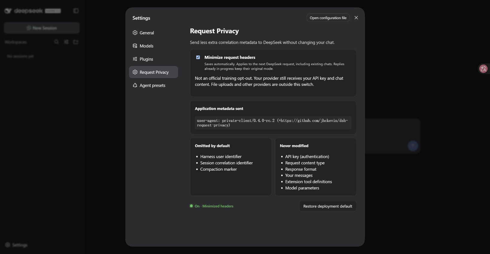
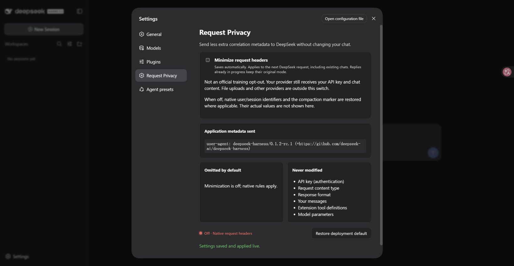

# DSH Request Privacy

[中文](README.md) · English

One switch for DeepSeek Harness: **send less extra correlation metadata while keeping your chats working.**

When enabled, DeepSeek chat requests use a `private-client` identity and omit Harness user, session and compaction headers. When disabled, the next request uses native headers again. Turning it off does not block your chat.

> **This is not an official training opt-out.** Fewer headers do not guarantee that a provider will not retain, filter or train on data. Your API key, chat content and tool descriptions are still sent. File uploads, telemetry and other providers are outside this switch. See [DeepSeek's data processing statement](https://deepseek.com/harness/en/data-processing/).

Prerelease: **0.4.0-rc.2**, for **DSH 0.1.2-rc.1**. Build, 16 automated tests and local Edge UI acceptance pass.

## Install once

### 1. Have DSH ready

Already using this DSH version? Skip to step 2.

Otherwise install [Node.js 24](https://nodejs.org/), then open a terminal and run:

```sh
npm install -g pnpm@11.7.0 @deepseek-ai/dsh@0.1.2-rc.1 --registry=https://registry.npmmirror.com
dsh --version
```

Release acceptance targets Linux x86-64. Other systems have not been verified.

### 2. Download the plugin

Download `dsh-request-privacy-0.4.0-rc.2.tgz` from [Releases](https://github.com/jhckevin/dsh-request-privacy/releases). **Do not extract it.** GitHub's automatic Source code archives are not installable plugin packages.

### 3. Install and restart DSH

Stop DSH first. Open a terminal in your download folder:

```sh
dsh plugin --profile web add ./dsh-request-privacy-0.4.0-rc.2.tgz --registry=https://registry.npmmirror.com --ignore-scripts
dsh --profile web
```

Open the URL printed in the terminal. It may contain a login token; do not share it.

**First installation requires restarting DSH.** Refreshing the browser is not a host restart. Install and start with the same profile; these instructions use the `web` profile.

In Settings, search the plugin list for `request-privacy`. All three components should be running (example shown in Chinese):


## Use one switch

1. Open **Settings** at the bottom left.
2. Select **Request Privacy**.
3. Toggle **Minimize request headers** and wait for the saved confirmation. It saves automatically.
4. Return to your chat and use your usual **DeepSeek** model.

No new session or provider selection is needed. The native `deepseek-official` route is covered, keeping its model, endpoint and stored credential settings. The older `deepseek-private` route remains for compatibility; new users do not need it.

| Action | Result |
| --- | --- |
| Enable successfully | New requests use minimized headers, including existing chats |
| Disable successfully | New requests use native headers; chatting still works |
| Toggle during a reply | The active request keeps its mode; the next request uses the new setting |
| Refresh or restart | Saved settings are retained |

The next request includes later model calls in the same turn and title/compaction calls using this DeepSeek route. It cannot recall data already sent. Existing history, summaries and tool descriptions are not scrubbed.

Enabled: minimized identity and omitted correlation metadata.



Disabled: saved immediately; the next request uses native headers.



## Update or uninstall

Update: stop DSH, download the new package, repeat the install command, then restart.

Uninstall: stop DSH, then run:

```sh
dsh plugin --profile web remove dsh-request-privacy
dsh --profile web
```

This restores the official DeepSeek adapter. Do not remove package files during an active chat.

## Questions

**No settings entry?** Check that both installation and startup use `--profile web`, restart DSH, then refresh the browser.

**Completely anonymous?** No. Providers can still correlate your API key, IP and content. This plugin does not switch off separate DSH telemetry.

**Custom YAML deployment?** Settings entered in the regular UI do not need migration. Handwritten configuration on the original `llm-deepseek` row must be moved to the replacement row: see [advanced notes](docs/architecture.md).

**Other providers?** Unchanged. Only the DeepSeek routes integrated by this plugin are covered.

## Verification and license

[Test notes](docs/RELEASE-040.md) · [CI](https://github.com/jhckevin/dsh-request-privacy/actions) · [Report a problem](https://github.com/jhckevin/dsh-request-privacy/issues)

MIT licensed. Uses DSH's official plugin composition without modifying host files. Retained upstream code is credited in [third-party notices](THIRD_PARTY_NOTICES.md).
