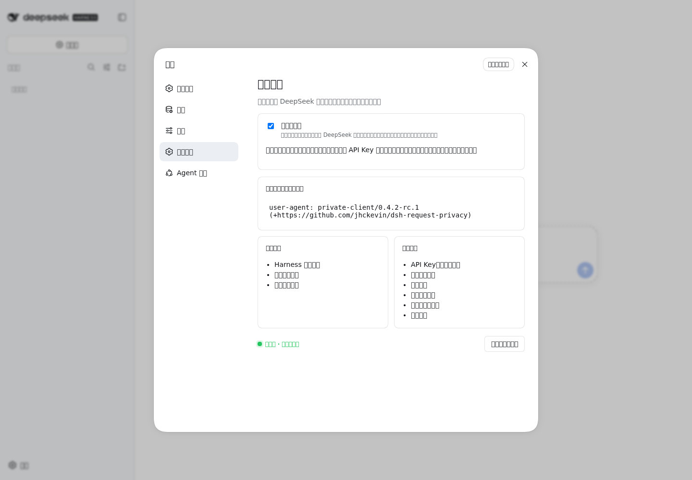
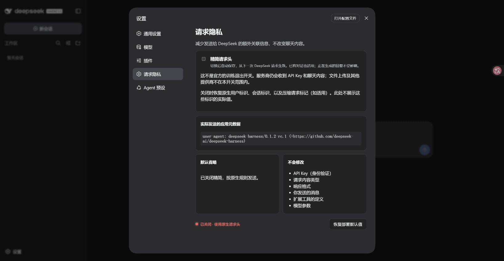
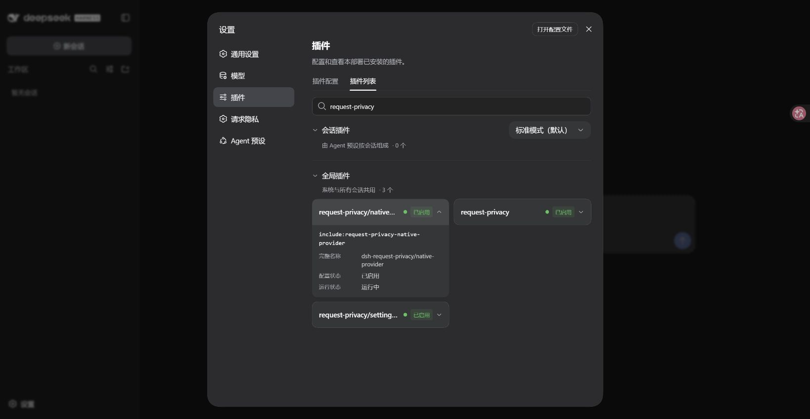

# DSH 请求隐私

中文 · [English](README.en.md)

给 DeepSeek Harness 增加一个开关，减少聊天请求携带的额外关联信息。

**开启**：使用 `private-client` 请求身份，不再附带 Harness 用户、会话和压缩标记。  
**关闭**：下一次请求恢复原生请求头，聊天照常进行。已有会话也适用，不用重新创建。

> 这不是官方的“不用于训练”开关，不能保证服务商不保存、筛选或训练。API Key、聊天内容和工具描述仍会发送；文件上传、遥测和其他提供商不在处理范围内。[了解隐私边界](https://deepseek.com/harness/en/data-processing/)

**版本：0.4.2-rc.2 · 适配 DSH 0.1.2-rc.1 · Linux x86-64** · [npm](https://www.npmjs.com/package/dsh-request-privacy)

## 安装：三步完成

在**运行 DSH 的那台机器**上操作。安装前先结束正在生成的回复，再停止 DSH；如果是在终端启动的，回到该终端按 `Ctrl+C`。

### 1. 确认 DSH 版本

已有 DSH 时运行 `dsh --version`，确认是 `0.1.2-rc.1`，然后进入下一步。

<details>
<summary>还没有安装 DSH？点这里</summary>

先安装 [Node.js 24](https://nodejs.org/)，再打开终端执行：

```sh
npm install -g pnpm@11.7.0 @deepseek-ai/dsh@0.1.2-rc.1 --registry=https://registry.npmmirror.com
```

已有 DSH 的用户可运行 `dsh --version` 检查版本。其他 DSH 版本和操作系统尚未验收，不要直接覆盖正在使用的其他版本。

</details>

### 2. 安装并重新启动

直接在终端执行，无需先下载文件：

```sh
dsh plugin --profile web add dsh-request-privacy@0.4.1-rc.1 --registry=https://registry.npmjs.org/ --ignore-scripts
dsh --profile web
```

第一行安装 npm 已发布版 `0.4.1-rc.1`，第二行启动 WebUI。无需下载源码、编译或手工改配置。

本页候选版 `0.4.2-rc.2` 尚未发布到 npm。体验本轮更新，请从 [GitHub 预发布](https://github.com/jhckevin/dsh-request-privacy/releases/tag/v0.4.2-rc.2) 下载 `dsh-request-privacy-0.4.2-rc.2.tgz`，执行：

```sh
dsh plugin --profile web add ./dsh-request-privacy-0.4.2-rc.2.tgz --ignore-scripts
dsh --profile web
```

安装的是公开预构建包，使用者无需 npm 账号或发布令牌。这里指定 npm 官方源，避免新版本尚未同步到镜像站；镜像同步后也可换用镜像源。不要用普通的 `npm install -g dsh-request-privacy` 代替，插件需要装进 DSH 的 profile。

离线传递安装包时，可从 [GitHub Releases](https://github.com/jhckevin/dsh-request-privacy/releases) 下载 `.tgz`，把上述命令中的 `dsh-request-privacy@0.4.2-rc.2` 换成安装包的本地路径，不用解压。

**首次安装后需要重启 DSH 一次。只刷新网页不够。** 安装和启动必须使用同一个 profile；这里使用默认网页配置 `web`。如果一直使用自定义 profile，请把两处 `web` 都换成自己的名称。

### 3. 打开设置

打开终端输出的网页地址 → 左下角 **设置 / Settings** → **请求隐私 / Request Privacy**。

切换 **精简请求头**，看到“设置已保存”即可。之后照常使用原来的 DeepSeek 模型，API Key、模型和地址继续沿用。

界面跟随 DSH 的全局语言设置：全局语言为中文时显示中文，切换为 English 时同步显示英文，无需单独配置插件语言。



## 开关什么时候生效？

| 操作 | 效果 |
| --- | --- |
| 开启并保存成功 | 下一次 DeepSeek 请求精简请求头，包括已有会话的新消息 |
| 关闭并保存成功 | 下一次请求恢复原生请求头，不影响正常聊天 |
| 回复生成中切换 | 已发出的请求保持原模式，下一次请求采用新设置 |
| 刷新网页或重启 DSH | 保留已经保存的开关状态 |

**安装后的开关无需重启，自动保存。** “下一次请求”也包括同一轮后续调用，以及走同一 DeepSeek 入口的标题和压缩请求。不会撤回已发送的数据，也不会清洗已有历史内容。



## 没看到入口怎么办？

1. 确认安装命令没有报错；若提示找不到新版本，请使用上面的 npm 官方源命令。
2. 确认安装与启动使用同一个 profile，且已经停止并重新启动 DSH。
3. 刷新网页，在设置的插件列表搜索 `request-privacy`，三个组件应显示 `running`。



如果提示 `pnpm: command not found`，先运行 `npm install -g pnpm@11.7.0 --registry=https://registry.npmmirror.com`，再重试安装。

如果 DSH 运行在服务器，插件也必须装到服务器上；使用你原有的安全访问方式打开网页，不要为此向公网开放端口。终端地址可能含登录令牌，请勿分享。

## 升级或卸载

升级：先确认新版本支持你的 DSH，停止 DSH，再用新版本号重复上述 `dsh plugin --profile web add` 命令并重新启动。当前预发布包使用 npm 的 `next` 通道；建议按本页固定版本安装，不盲目跨 DSH 版本升级。

卸载：先停止 DSH，再执行：

```sh
dsh plugin --profile web remove dsh-request-privacy
dsh --profile web
```

卸载后恢复官方 DeepSeek 适配器。

<details>
<summary>高级配置与限制</summary>

- 本插件覆盖原生 `deepseek-official` 入口，旧的 `deepseek-private` 入口保留兼容，新用户无需切换入口。
- 仅处理接入的 DeepSeek 聊天请求，不影响其他提供商或第三方自建适配器。
- 普通设置页面中的配置无需迁移；手写在原 `llm-deepseek` 行的 YAML 配置，需要按 [高级说明](docs/architecture.md) 迁移。
- API Key、IP 和聊天内容仍可能关联请求，本插件不提供匿名化或训练退出保证。
- 安装使用 DSH 官方 [profile 插件机制](https://github.com/deepseek-ai/deepseek-harness/blob/dsh-v0.1.2-rc.1/apps/cli/src/plugin.ts)，不修改宿主文件。

</details>

## 许可证

MIT 开源；上游代码及许可见 [第三方声明](THIRD_PARTY_NOTICES.md)。
