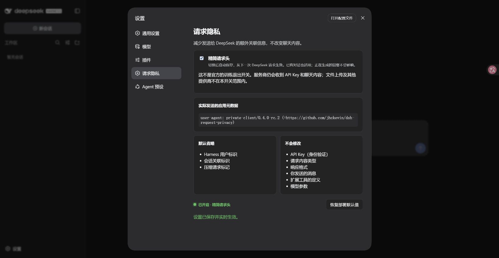

# DSH 请求隐私

中文 · [English](README.en.md)

给 DeepSeek Harness 添加一个简单开关：**少发一些额外关联信息，聊天照常进行。**

开启后，DeepSeek 聊天请求使用 `private-client` 身份，不再附带 Harness 用户标识、会话标识和压缩标记。关闭后，下一次请求恢复原生请求头，不会禁止聊天。

> **这不是官方的“不用于训练”开关。** 修改请求头只能减少额外元数据，不能保证服务商不保存、筛选或训练。API Key、聊天内容、工具描述仍会发送；文件上传、遥测及其他提供商不在本插件的请求头处理范围内。参见 [DeepSeek 数据处理说明](https://deepseek.com/harness/en/data-processing/)。

当前预发布版本：**0.4.0-rc.2**，匹配 **DSH 0.1.2-rc.1**。构建、16 项自动测试和本机 Edge 界面验收通过。

## 安装：只需做一次

### 1. 准备好 DSH

已经能正常使用这个版本的 DSH？直接跳到第 2 步。

新用户先安装 [Node.js 24](https://nodejs.org/)，然后在终端执行：

```sh
npm install -g pnpm@11.7.0 @deepseek-ai/dsh@0.1.2-rc.1 --registry=https://registry.npmmirror.com
dsh --version
```

当前发行验收以 Linux x86-64 为准，其他系统尚未验证。

### 2. 下载插件

到 [Releases](https://github.com/jhckevin/dsh-request-privacy/releases) 下载 `dsh-request-privacy-0.4.0-rc.2.tgz`，**不用解压**。不要下载 GitHub 自动生成的 Source code 压缩包。

### 3. 安装，然后重启 DSH

先停止正在运行的 DSH。在下载目录打开终端，执行：

```sh
dsh plugin --profile web add ./dsh-request-privacy-0.4.0-rc.2.tgz --registry=https://registry.npmmirror.com --ignore-scripts
dsh --profile web
```

打开终端给出的网页地址。地址可能带有登录令牌，请勿转发。

**首次安装需要重新启动 DSH**，刷新网页不等于重启。插件安装在哪个 profile，就只影响那个 profile；本文使用 WebUI 的 `web` profile。

可在设置的插件列表搜索 `request-privacy`，确认三个组件均为 running：


## 使用：一个开关即可

1. 打开左下角 **Settings / 设置**。
2. 选择 **Request Privacy / 请求隐私**。
3. 切换 **Minimize request headers / 精简请求头**，等待“设置已保存”。开关会自动保存，无需再点保存按钮。
4. 回到对话，照常使用原来的 **DeepSeek** 模型。

不用创建新会话，也不用切换到另一个模型入口：原生 `deepseek-official` 入口已接入。设置中的 API Key、模型和地址继续沿用。老版本的 `deepseek-private` 入口保留兼容，但新用户无需选择它。

| 你怎么操作 | 接下来的行为 |
| --- | --- |
| 开启并保存成功 | 新请求精简请求头，已有会话也适用 |
| 关闭并保存成功 | 新请求恢复原生请求头，仍可正常聊天 |
| 回复正在生成时切换 | 已发出的请求保持原样，下一次请求使用新设置 |
| 刷新或重启 | 使用已经保存的设置 |

“下一次请求”也包括同一轮对话后续的模型调用，以及经由这个 DeepSeek 入口的标题、压缩请求。不会撤回已经发送的数据。已有历史内容、摘要或工具描述不会被清洗。

开启：显示精简身份和不再附带的关联信息。



关闭：立即保存，下一次请求恢复原生身份。


## 升级或卸载

升级：停止 DSH → 下载新版本插件包 → 重复安装命令 → 重启 DSH。

卸载同样先停止 DSH，再执行：

```sh
dsh plugin --profile web remove dsh-request-privacy
dsh --profile web
```

卸载后恢复官方 DeepSeek 适配器。不要在聊天进行中删除插件包。

## 常见问题

**安装后没看到入口？** 确认安装和启动都用了 `--profile web`，并真正重启了 DSH。必要时再刷新浏览器。

**开启就完全匿名了吗？** 不是。提供商依然能通过 API Key、IP、内容等关联请求。本插件也不会关闭 DSH 独立的遥测功能。

**我手工修改过 `cordis.patch.yml`？** 普通设置页面里的配置无需迁移。手写在原 `llm-deepseek` 行里的部署配置，需要按 [高级说明](docs/architecture.md) 迁移到替代行；不要直接安装后假设所有手工覆盖都会继承。

**其他模型也生效吗？** 只处理本插件接入的 DeepSeek 入口；其他提供商、第三方自建适配器不受影响。

## 验证与许可证

[测试记录](docs/RELEASE-040.md) · [公开 CI](https://github.com/jhckevin/dsh-request-privacy/actions) · [反馈问题](https://github.com/jhckevin/dsh-request-privacy/issues)

MIT 开源，使用 DeepSeek Harness 的官方插件组合机制，无需修改宿主文件。保留的上游代码与许可见 [第三方声明](THIRD_PARTY_NOTICES.md)。
